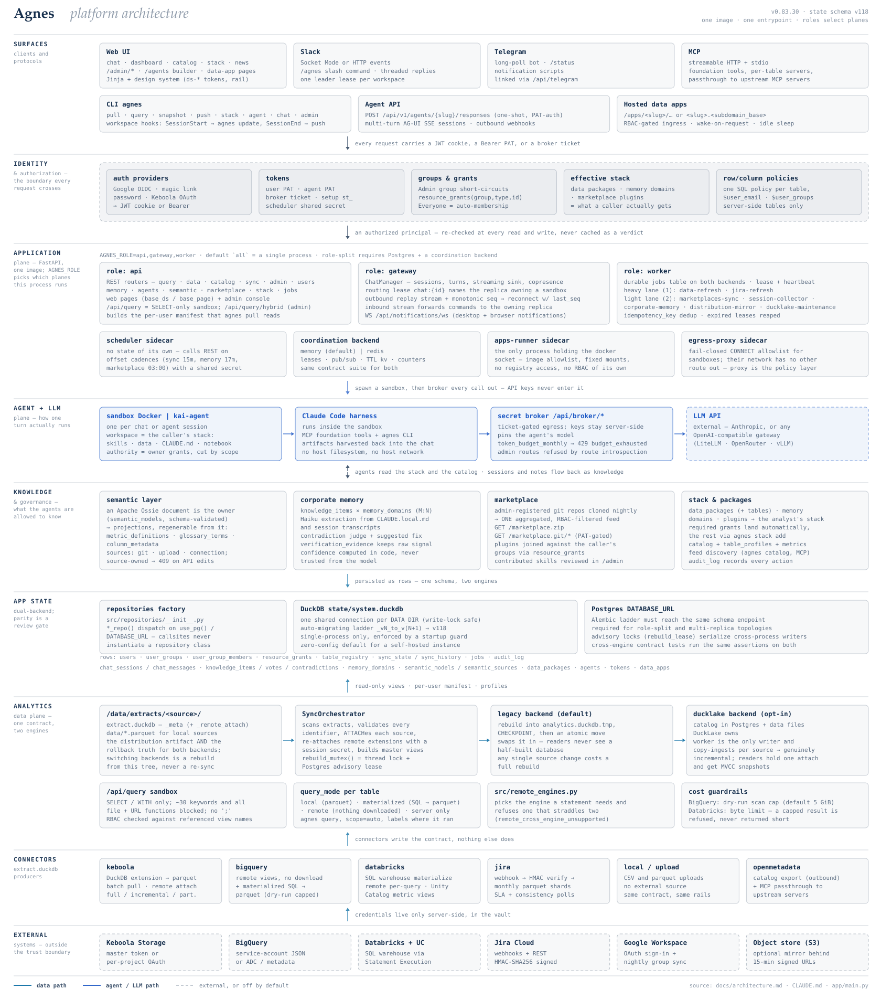

# Architecture

## Visual overview

Nine layers, read top to bottom: who talks to Agnes, the boundary every request
crosses, the three process planes that serve it, how one agent turn runs, what the
agents are allowed to know, where state lives, and how the data got there.

[](docs/diagrams/agnes-architecture.svg)

Two cycles a layered drawing necessarily flattens — how data reaches a laptop and
what comes back, and which engine actually executes a statement:

[](docs/diagrams/agnes-analyst-loop.svg)

[](docs/diagrams/agnes-query-routing.svg)

All three are generated by
[`scripts/dev/gen_architecture_diagrams.py`](scripts/dev/gen_architecture_diagrams.py)
— edit the script, rerun it, and commit the regenerated SVGs. It refuses to
produce a figure whose text does not fit its box, so a drifted label fails loudly
instead of shipping clipped.

## System Overview

```
┌──────────────┐  ┌──────────────┐  ┌──────────────┐
│   Keboola    │  │   BigQuery   │  │   Jira       │
│  extractor   │  │  extractor   │  │  webhooks    │
│ (DuckDB ext) │  │ (remote BQ)  │  │ (incremental)│
└──────┬───────┘  └──────┬───────┘  └──────┬───────┘
       │                 │                 │
       ▼                 ▼                 ▼
   extract.duckdb    extract.duckdb    extract.duckdb
   + data/*.parquet  (views → BQ)      + data/*.parquet
       │                 │                 │
       └─────────────────┼─────────────────┘
                         ▼
              SyncOrchestrator.rebuild()
              ATTACH → master views in analytics.duckdb
                         │
              ┌──────────┴──────────┐
              ▼                     ▼
          FastAPI                  CLI
          (serve)               (agnes pull)
```

Four source modes (per-table `query_mode`):
- **Batch pull** (Keboola, `local`): DuckDB extension downloads to parquet, scheduled
- **Remote attach** (BigQuery, `remote`): DuckDB BQ extension, no download, queries go to BQ
- **Materialized SQL** (`materialized`): scheduler runs admin-registered SQL through DuckDB and writes the result to parquet, distributed like local tables
- **Real-time push** (Jira): Webhooks update parquets incrementally

## Components

### 1. Core Engine (`src/`)

DuckDB-backed data orchestration and state management.

| File | Role |
|------|------|
| `src/db.py` | DuckDB schema (system.duckdb, analytics.duckdb), auto-migrating v1→vN (current version lives in `src/db.py`) |
| `src/orchestrator.py` | SyncOrchestrator — ATTACHes extract.duckdb files, rebuilds master views |
| `src/orchestrator_security.py` | Extension allowlist, token-env validation, SQL string escaping |
| `src/identifier_validation.py` | Shared regex validators for SQL identifiers (used by orchestrator + extractors) |
| `src/remote_query.py` | RemoteQueryEngine — hybrid queries joining local + BigQuery data |
| `src/repositories/` | DuckDB-backed CRUD (sync_state, table_registry, users, knowledge, etc.) |
| `src/profiler.py` | Data profiling for catalog UI |
| `src/scheduler.py` | Schedule parsing (`every 15m`, `daily 03:00`) and `is_table_due()` |
| `src/rbac.py` | Dataset-access helpers (`can_access_table`, `get_accessible_tables`) |
| `src/marketplace.py` | Marketplace git-clone/sync + plugin manifest parsing |
| `src/marketplace_filter.py` | RBAC-filtered plugin resolution for ZIP/git channels |

### 2. FastAPI Application (`app/`)

Unified web server for UI + REST API.

| File/Dir | Role |
|----------|------|
| `app/main.py` | FastAPI app setup, router registration, startup hooks |
| `app/api/` | REST API endpoints (sync, data, catalog, admin, auth, query, memory, etc.) |
| `app/auth/` | Authentication — router, dependencies, PAT resolver, group sync |
| `app/auth/providers/` | Auth providers: Google OAuth, email magic link, password |
| `app/web/` | HTML dashboard routes + Jinja2 templates |
| `app/resource_types.py` | `ResourceType` StrEnum + `RESOURCE_TYPES` registry for RBAC |

### 3. Connectors (`connectors/`)

Each connector produces an `extract.duckdb` following a standard contract.

| Directory | Source Type | Mechanism |
|-----------|-------------|-----------|
| `connectors/keboola/` | Batch pull | DuckDB Keboola extension → parquet files |
| `connectors/bigquery/` | Remote attach | DuckDB BQ extension → views to BigQuery |
| `connectors/jira/` | Real-time push | Webhooks → incremental parquet updates |
| `connectors/llm/` | LLM routing | OpenAI-compatible API client |

#### extract.duckdb Contract

Every connector outputs to `/data/extracts/{source_name}/`:

```
/data/extracts/{source_name}/
├── extract.duckdb          ← _meta table + views
└── data/                   ← parquet files (local sources only)
```

The `_meta` table (required):
```sql
CREATE TABLE _meta (
    table_name   VARCHAR,
    description  VARCHAR,
    rows         INTEGER,
    size_bytes   INTEGER,
    extracted_at TIMESTAMP,
    query_mode   VARCHAR   -- 'local' or 'remote'
);
```

Remote tables (`query_mode='remote'`) must also include `_remote_attach`:
```sql
CREATE TABLE _remote_attach (
    alias     VARCHAR,  -- DuckDB alias used in views, e.g. 'kbc'
    extension VARCHAR,  -- Extension name, e.g. 'keboola'
    url       VARCHAR,  -- Connection URL
    token_env VARCHAR   -- Env-var name holding the auth token (NOT the token itself)
);
```

The SyncOrchestrator scans `/data/extracts/*/extract.duckdb`, ATTACHes each into the master `analytics.duckdb`, and creates views. For remote tables, it reads `_remote_attach`, installs/loads the extension, reads the token from the environment, and ATTACHes the external source.

### 4. CLI (`cli/`)

Command-line tool `da` for sync, query, and admin operations.

| Command | Role |
|---------|------|
| `agnes pull` | Trigger data sync |
| `agnes query` | Run SQL against analytics.duckdb |
| `agnes admin group *` | Manage user groups |
| `agnes admin grant *` | Manage resource grants |
| `agnes admin register-table` | Register tables in table_registry |
| `agnes admin break-glass <user>` | Emergency admin access recovery |
| `agnes auth token *` | Manage personal access tokens |
| `agnes admin metrics *` | Business metric definitions |
| `agnes skills *` | List/show bundled skills |

### 5. Authentication (`app/auth/`)

FastAPI-based auth with pluggable providers.

| File | Role |
|------|------|
| `app/auth/router.py` | Auth routes (login, callback, bootstrap, token) |
| `app/auth/providers/google.py` | Google OAuth + Workspace group sync |
| `app/auth/providers/email.py` | Email magic link (atomic compare-and-swap consumption) |
| `app/auth/providers/password.py` | Password login + reset (with audit logging) |
| `app/auth/pat_resolver.py` | Personal Access Token validation (hash, expiry, revocation, IP audit) |
| `app/auth/access.py` | Authorization: `require_admin`, `require_resource_access` |
| `app/auth/group_sync.py` | `fetch_user_groups()` — Cloud Identity API client |
| `app/auth/dependencies.py` | `get_current_user` FastAPI dependency |
| `app/auth/jwt.py` | Desktop JWT auth (API-only) |

### 6. Standalone Services (`services/`)

Self-contained services with own `__main__.py`, run via Docker Compose profiles.

| Directory | Role |
|-----------|------|
| `services/scheduler/` | Cron-like job runner (data-refresh, health-check, marketplaces) |
| `services/telegram_bot/` | Telegram notification bot + dispatch (opt-in, `--profile full`) |
| `services/corporate_memory/` | AI knowledge aggregation from analyst sessions |
| `services/session_collector/` | Claude Code session metadata collector |

### 7. Configuration (`config/`)

| File | Role |
|------|------|
| `config/instance.yaml.example` | Template with all options |
| `config/loader.py` | YAML loader with `${ENV_VAR}` interpolation + required-field validation |
| `config/.env.template` | Secret variable placeholders |

Table definitions are stored in DuckDB `table_registry` table (not in config files).

## Config Loading Chain

```
config/instance.yaml
    |  (loaded by config/loader.py)
    |  (${ENV_VAR} references resolved from .env / environment)
    |  (required fields validated: instance.name, auth.allowed_domain, server.host, server.hostname)
    v
app/instance_config.py
    |  (get_value() for safe nested access)
    v
FastAPI app + templates
```

## Data Flow

```
1. Admin registers tables via /api/admin/register-table or web UI
2. Table metadata stored in DuckDB table_registry (system.duckdb)
3. Scheduler triggers data-refresh (default every 15m)
4. POST /api/sync/trigger invokes each connector's extractor
5. Extractor produces extract.duckdb + parquet files (local) or remote views
6. SyncOrchestrator.rebuild() ATTACHes extract.duckdb files into analytics.duckdb
7. FastAPI serves data via /api/data/{table_id}/download and /api/query
8. Claude Code queries analytics.duckdb via SQL for analysis
```

## Security Model

- **Authentication**: Google OAuth, email magic link, password, PAT, desktop JWT
- **Authorization**: Two-layer RBAC — Admin user-group (god mode) + resource-level grants
- **Session cookies**: Signed via Starlette SessionMiddleware (secret from `SESSION_SECRET`)
- **Bootstrap**: `SEED_ADMIN_EMAIL` env var seeds first admin at deploy time
- **Identifier validation**: Shared regex validators prevent SQL injection in table/connector names
- **Orchestrator hardening**: Extension allowlist, token-env validation, SQL string escaping
- **SSRF protection**: `_validate_url_not_private()` on admin configure endpoint
- **Container**: Runs as non-root user `agnes`; Docker resource limits enforced
- **TLS**: Caddy reverse proxy with security headers (X-Frame-Options, X-Content-Type-Options, Referrer-Policy)
- **Secrets**: `${ENV_VAR}` in YAML, actual values in `.env` (gitignored); PATs stored as hashes

## Key Patterns

- **Connector pattern**: `connectors/{name}/extractor.py` produces `extract.duckdb` following the `_meta` + `_remote_attach` contract. Orchestrator auto-discovers and ATTACHes.
- **Auth provider pattern**: `app/auth/providers/{name}.py` — Google, email, password. Router dispatches based on instance config.
- **Repository pattern**: `src/repositories/{domain}.py` — DuckDB-backed CRUD with parameterized queries and `ALLOWED_FIELDS` allowlists.
- **Resource type pattern**: `app/resource_types.py` — `ResourceType` StrEnum + `ResourceTypeSpec` registry. Adding a new type = one enum member + one `list_blocks` delegate + one spec entry. No DB migration.
- **Atomic token consumption**: Compare-and-swap with `CONSUMED:` marker prevents race conditions on one-shot tokens (magic links, password resets).
- **Config interpolation**: `${ENV_VAR}` in YAML resolved at load time, missing vars logged as warnings.
