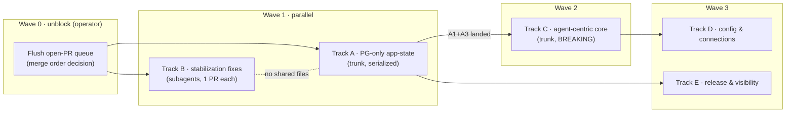

# Agnes Remediation Program Plan

> **For agentic workers:** REQUIRED SUB-SKILL: Use superpowers:subagent-driven-development (recommended) or superpowers:executing-plans to implement this plan task-by-task. Steps use checkbox (`- [ ]`) syntax for tracking.
>
> **Program-plan note:** This document is the master plan for a multi-subsystem
> remediation program. Work packages in Track B are specified to
> directly-executable depth (exact files, exact acceptance tests) — dispatch
> them to `agnes-builder` as-is, one PR each. Tracks A and C are trunk efforts:
> their interfaces, schema and gates are locked here, and each spawns its own
> writing-plans-grade plan (listed per track) at execution start. Do not
> attempt to execute A or C directly from this document alone.

**Goal:** Converge Agnes from "every feature exists twice and half-wired" to a
single-spine product: one app-state backend (Postgres), one agent model with
agent-owned grants and a runtime for shared agents, one registration flow, one
config source of truth, and a release process an admin can actually follow.

**Architecture:** Three parallel tracks. Track A (trunk) removes the DuckDB
app-state backend so everything after it is written once. Track B
(subagent-parallel) fixes the confirmed, independently-shippable defects from
the 2026-08 audit — each is one PR with no dependency on A or C. Track C
(trunk, starts once A1+A3 land) rebuilds the agent layer around agent-owned
grants and shared-agent runtime, followed by config collapse (D) and
release/visibility (E).

**Tech Stack:** FastAPI, Postgres (app-state), DuckDB (analytics only — not
touched), Alembic, Jinja2 + design-system tokens, pytest, GitHub Actions.

**Spec:** The 2026-08 audit findings this plan argues from are embedded in
§Findings basis below (compact form, with file references). The audit itself
was produced in a private working session; every claim in §Findings was
verified against `main@b62bf91eb`.

## Locked decisions (owner-approved 2026-08-24)

| # | Decision |
|---|---|
| LD1 | **Parallel tracks.** Trunk work (A, then C) runs in this program's main line; Track B stabilization fixes run in parallel via subagents, one isolated worktree + PR each. |
| LD2 | **Agent-owned grants.** A shared agent's authority comes from grants attached to the *agent itself* (data packages as the primary grantable), not from an intersection with its owner's rights. The owner disappears from the authority equation. |
| LD3 | **Breaking changes allowed, with migration + announcement.** Old surfaces are deleted, data migrates automatically, `**BREAKING**` changelog entries + admin-facing "what changed" required. No long deprecation windows, no permanent feature flags. |
| LD4 | **PG-only app-state starts immediately.** New work is written PG-first from now on; the DuckDB app-state backend is frozen, migrated off, then deleted. Analytics DuckDB (extract contract, analyst-side queries, snapshots) is explicitly out of scope and stays. |

## Global constraints

- Every PR: `scripts/verify_syncmap.py` + the guards the diff touches locally; full suite runs in CI (draft PR opened after the first commit; watch checks — green = completed AND jobs>0 AND success).
- Every behavior-changing PR carries its CHANGELOG bullet under `[Unreleased]` in the same PR; breaking changes prefixed `**BREAKING**`.
- Vendor-agnostic repo rules apply to every diff and PR body (no customer names, hostnames, project IDs).
- Review loop per repo convention: `/agnes-review` → fix → external reviewer → repeat until clean.
- No new boolean scope flags on CLI commands; `--scope auto|local|server` only (command-ux standard).
- Nothing in this program touches `connectors/jira/file_lock.py`.
- Merging is a separate human decision; this program produces READY PRs, it does not merge them.

## Findings basis (embedded spec extract)

The five diseases, each with the anchor findings a track must cure:

**N1 — configuration has no source of truth.** 254 env vars, 74 active
instance.yaml keys, ~70 Terraform knobs, 112 admin-UI fields; precedence
`env > UI overlay > yaml > default` (`app/instance_config.py:384-401`) while
provisioning rewrites `.env` on every boot — any TF-set knob makes its UI
control permanently inert. Dead config: `jira:` section read by nothing
(`app/api/admin.py:581`), `email.from_name` inert, `admins:`/`server.ssh_*`
unread, `compose_ref` retired.

**N2 — two mechanisms per job.** Two agent APIs over one table (`/api/agents`
in `app/api/agents.py` vs `/api/v1/agents` in `app/api/agents_admin.py`); two
chat backends (`/api/chat` vs `/api/v1/sessions`, histories don't cross); 8
table-registration flows over 4 config stores; ~11 semantic-metadata stores, 5
writer families into `metric_definitions`; 7 audit trails, no shared viewer;
dual app-state backend (64 repo pairs, ~62k LOC tax).

**N3 — silent disconnected states.** `sync_state` written keyed by registry
*name* (`app/api/sync.py:394-400`) but read by *id* on two surfaces
(`app/web/router.py:7454`, `:6952`); `/admin/tables` has no sync-status column
(`admin_tables.html:8442-8452`); the data-source wizard never triggers a sync;
a manually-POSTed semantic model never projects (`app/api/semantic_models.py:161-196`
has no `project_document` call); `/api/v2/schema` hardcodes `"description": ""`
on all three branches (`app/api/v2_schema.py:70,221,301`); Keboola
`query_mode='remote'` is engine-supported (`connectors/keboola/extractor.py:914-958`)
but offered by no UI; the wizard's per-connection token feeds only the
materialized pass (`app/api/sync.py:447-513`) while the local/remote extractor
reads one global env credential (`app/api/sync.py:977-983`).

**N4 — access model grown in layers.** 7 mechanisms + 2 modifiers; a new
analyst needs ~6 admin actions across 3 UIs. Agent authority =
`owner per-table grants ∩ scope` (`src/agent_scope_intersection.py:52-63,173`)
— package-only tables are invisible to agents; the builder UI writes scope
fields the runtime never reads (`app/api/agents.py:431-447` passes no
`*_mode`, defaults `'all'` in `src/repositories/agents.py:72-75` → passthrough
of the owner's full identity, `app/api/broker.py:295-302`); a grantee of a
shared agent cannot run it anywhere (`app/api/agent_runtime.py:168`,
`app/api/chat.py:155` resolve owner-scoped only).

**N5 — process treadmill.** ~15–25 hand-cut patch releases/day with a
structural CHANGELOG rename race; no in-app "what changed" for admins (`/news`
is a hand-written blog, `app/web/router.py:1555-1594`); 20.4k tests / 6.9
CPU-hours with `create_app()`-per-test still live in 98 files; app logs are
stdout-only with the `gcplogs` compose overlay placed by nothing; audit
trails have zero retention policy.

---

## Program map



Dependency rules:
- **B never blocks on A or C** — B packages are chosen so none touches the
  agent model or the repo-factory layer.
- **C starts when A1 (PG default for new installs) and A3 (PG-first rule) are
  merged** — C's new tables are then Alembic-only, no DuckDB ladder step, no
  `_pg.py` sibling.
- **A4 (deletion) is last in A** and requires the fleet report from A2 to show
  zero DuckDB-state instances.

---

## Wave 0 — unblock (operator actions, not PRs)

- [ ] **P0.1** Decide merge order for the currently-open READY PRs (several
  carry release-cuts that renumber on every foreign merge). Until flushed,
  every program PR rebases into the same race.
- [ ] **P0.2** Merge the deployment gate PR (new-instance doctor + extended
  post-deploy smoke) if still open — LD3 (breaking-with-migration) leans on it.
- [ ] **P0.3** Merge the test-diet PRs (shared app fixture + lazy imports) if
  still open — every track below pays the suite cost on every push.

---

## Track A — PG-only app-state (trunk; spawns its own detailed plan per package)

Sub-plans to write at execution start: `2026-08-XX-pg-default-install.md`
(A1), `2026-08-XX-pg-fleet-migration.md` (A2), `2026-08-XX-duckdb-state-removal.md` (A4).

### A1: Postgres is the default app-state for new installs

**AMENDED 2026-08-24 — detailed plan: `2026-08-24-pg-default-install.md`.**
The original "fold postgres into the default compose graph" sketch was
rejected during detailed planning: the resolver keys the postgres overlays
off persisted backend state, and shipping a `postgres` service +
`DATABASE_URL` in the base graph would stealth-migrate every existing
DuckDB-state instance on its next auto-upgrade tick. Instead A1 flips the
**first-boot seed** to `backend: side_car`
(`startup-script.sh.tpl:100-111`; existing instances keep their persisted
value), updates the state-machine/docs/quickstart defaults, adds an
`app_state_backend` check to the new-instance doctor, and re-points the
release smoke gate at the PG chain. No schema change; base compose file
untouched.

**Acceptance:** per the detailed plan — tpl-grep guards
(`tests/test_startup_pg_default.py`), quickstart/docs guards, doctor check
tests, smoke gate boots `docker-compose.yml:docker-compose.postgres.yml`,
`**BREAKING**` changelog bullet (fresh installs need `POSTGRES_PASSWORD`;
DuckDB app-state legacy-only for new deploys until A4 removes it).

### A2: fleet migration off DuckDB app-state

**Files:** `scripts/ops/` (one new idempotent `agnes-state-migrate.sh`
wrapping the existing `DUCKDB → SIDE_CAR` transition), `src/db_state_machine.py`
(no new states; add a `state report` CLI read-out), `cli/commands/admin.py`
(`agnes admin state` shows backend + migration readiness).

**Interfaces:**
- Consumes: existing `scripts/migrate_duckdb_to_pg` data-migrate path and the
  state-applier flow; existing rollback (`copy_pg_to_duckdb`) stays available
  until A4.
- Produces: per-instance report `{backend, rows_copied, verified}` consumed by
  A4's precondition check.

**Acceptance:**
- [ ] Dry-run + apply on a dev VM first, then per-instance across the fleet
  (operator-driven, one instance at a time; instance restart via
  `--no-deps --force-recreate app scheduler`, never bare `up -d`).
- [ ] `agnes admin state` on every instance reports `side_car`/`cloud`.

### A3: PG-first development rule (ratchet flip)

**Files:** `CLAUDE.md` (Dual-backend discipline section — retire "same PR must
touch both backends", replace with "new app-state work is PG-only; DuckDB
app-state is frozen"), `CONTRIBUTING.md` sync-map rows for parity,
`tests/test_backend_split_guard.py` (flip from "every repo needs both
backends" to "no NEW DuckDB app-state repo may be added; existing pairs
frozen"), `tests/db_pg/test_repo_method_parity.py` (freeze list).

**Interfaces:**
- Produces: Track C may create Alembic-only tables (no `src/db.py` `_vN` step,
  no DuckDB repo sibling) without tripping any guard.

**Acceptance:**
- [ ] Negative control: a branch adding a new `src/repositories/foo.py`
  DuckDB repo fails the guard; a branch adding `foo_pg.py` + factory entry
  alone passes.
- [ ] `tests/test_db_schema_version.py` updated so the DuckDB ladder is
  allowed to stop at its frozen version while Alembic advances.

### A4: delete the DuckDB app-state backend

Runs only after A2 reports zero DuckDB-state instances. Deletes the ~64
DuckDB repo siblings, the `src/db.py` migration ladder (file shrinks to
analytics-DB setup), collapses `tests/db_pg/` contract tests to
single-backend, removes the `duckdb`/`side_car` transition pair from the
state machine (PG rollback path is dropped with an explicit `**BREAKING**`
note), and re-points `cli_auth_codes`' `operational.duckdb` fallback
(`app/api/cli_auth.py:62-92`) at PG. Its own plan enumerates the deletions;
target ≈ −25–30k LOC.

---

## Track B — stabilization fixes (subagents; each item = one isolated worktree + one PR)

Dispatch each to `agnes-builder` with this plan section as the task brief.
None touches `app/api/agents*.py`, `app/api/broker*.py`, or
`src/repositories/__init__.py` (reserved for A/C).

### B1: one key for sync state + status where admins look

**Files:** Modify `app/api/sync.py:394-400` (write `sync_state.table_id` =
registry **id**), `src/orchestrator.py:1510-1543` (same), one-shot backfill in
an Alembic revision + frozen-ladder exemption note, `app/api/admin.py:3966-3993`
(registry join by id), `app/web/templates/admin_tables.html` (add a Sync
column rendering the same pill as `admin_sync.html:250-258`).
**Test:** `tests/test_sync_state_key.py`.

- [ ] Failing test first: register a table whose display name ≠ id (e.g.
  `name="Web Sessions"`, id `web_sessions`), simulate one sync, assert BOTH
  `/api/admin/registry` and the `/admin/data-sources` pipeline context report
  the same `last_sync` (today one of them is `null` — the audit's split-brain).
- [ ] Backfill migrates existing name-keyed rows to id-keyed (match on
  registry name; unmatched rows logged, not dropped).
- [ ] `/admin/tables` shows the status pill; design-system contract tests stay
  green (tokens only, no raw hex).

### B2: Keboola remote + wizard honesty

**Files:** `app/web/templates/admin_tables.html:2053-2086` (+ payload sites
`:4906,:4936`) — add the "Live (remote)" option for Keboola, same wording as
the BigQuery/Databricks/Snowflake modals; `app/web/templates/admin_data_sources.html:2353`
(stop hardcoding `materialized`; offer mode choice), post-registration call to
`POST /api/sync/trigger` from the wizard's finish step; `app/api/sync.py:916-983`
— extractor credential resolution: resolve per-connection vault token for
`local`/`remote` rows (same lookup the materialized pass uses at `:447-513`);
if a row's connection has no resolvable token, **fail the row loudly** in
`sync_state.error` instead of silently using the global env token.
**Test:** `tests/test_keboola_remote_ui.py`, extend `tests/test_sync_connection_tokens.py`.

- [ ] Failing test: register a Keboola row `query_mode='remote'` via the
  admin API and assert the tables page offers the mode (template unit test on
  rendered options), and that a second-connection `local` row without env
  creds errors with `missing_connection_token` rather than extracting with
  the wrong token.
- [ ] Wizard finish → one `sync/trigger` call (assert via TestClient spy).

### B3: semantics quick wins

**Files:** `app/api/semantic_models.py:161-196` (call
`src/semantic/projection.py::project_document` after storing a manual model;
same for update), `app/api/v2_schema.py:70,221,301` (join `column_metadata`
and Ossie field descriptions into `description` on all three branches),
`src/semantic/projection.py:404-407` (Snowflake-dialect skip: record a
per-model warning surfaced in `/semantic-layer` model card instead of
dropping silently).
**Test:** `tests/test_semantic_projection_on_write.py`, extend
`tests/test_v2_schema.py`.

- [ ] Failing test: POST a manual Ossie document with 2 metrics → assert
  `metric_definitions` contains both (today: zero).
- [ ] Failing test: set a column description via `POST /api/admin/metadata`,
  assert `agnes schema`'s endpoint returns it (today: `""`).
- [ ] Snowflake-dialect model shows "N metrics skipped (dialect)" on its card.

### B4: CLI unblocks

**Files:** `app/auth/dependencies.py:397-456` — relax `require_session_token`
to accept a plain user PAT for the READ endpoints of agent management
(`GET /api/v1/agents`, `GET .../schedules`, `GET .../memories`); mutating
endpoints keep session-token-only. `cli/commands/explore.py:16` — replace
`--remote` boolean with `--scope auto|local|server` (frozen alias kept).
Add `--json` to `skills list`, `store mine`, `store status`,
`admin news versions`, `admin news current`.
**Test:** `tests/test_agent_cli_pat_reads.py`, extend the command-ux checks.

- [ ] Failing test: TestClient call to `GET /api/v1/agents` with a `typ=pat`
  token returns 200 + the caller's agents (today: 403
  `requires an interactive session`).
- [ ] `agnes explore` passes `scripts/verify_syncmap.py::check_scope_flags`
  on its own diff.

### B5: logs that survive, setup that doesn't lie

**Files:** `infra/modules/customer-instance/startup-script.sh.tpl` — place
`docker-compose.gcp-logging.yml` (extracted from the image like other host
artifacts) and include it in the resolver's overlay list when
`logging.driver=gcplogs` (new TF var, default **on**); write
`/etc/docker/daemon.json` log-rotation (`json-file`, `max-size=50m`,
`max-file=5`) for the non-gcplogs path. `app/web/templates/setup.html:74-247`
— remove the "Local / CSV" dead-end tile; replace with the honest guidance
pane already used on `/admin/data-sources` (`admin_data_sources.html:1130-1143`).
**Test:** infra: `terraform validate` + startup-script bats-style assertion
if present; app: extend `tests/test_first_time_setup*.py` for the removed tile.

- [ ] Overlay file exists on a module-provisioned VM and the compose resolver
  includes it (assert in the resolver script's unit test).
- [ ] `/setup` no longer offers a source type that has no connector.

### B6: auth default — password in, magic link opt-in

**Files:** `app/auth/provider_registry.py` (default offering when
`auth.providers` unset: `google, password` if Google configured, else
`password`; email magic link only when explicitly listed),
`app/auth/providers/password.py` — add self-serve change-password for a
logged-in session (`POST /auth/password/change` verifying the current
password, reusing the argon2 + rate-limit plumbing), link it from the profile
menu. `config/instance.yaml.example` + `docs/` updated.
**Test:** `tests/test_auth_provider_defaults.py`, `tests/test_password_change.py`.

- [ ] Failing test: with no `auth.providers` config and SMTP set, the login
  page offers password and NOT the magic link (today magic link appears).
- [ ] Change-password: wrong current password → 403; success → old password
  refused, new accepted; audit row written.
- [ ] `**BREAKING**` changelog: instances relying on implicit magic-link
  offering must add `email` to `auth.providers`.

### B7: dev-kit truth

**Files:** move `\.claude/skills/{agnes-connectors,agnes-orchestrator,agnes-rbac,agnes-release-process}.md`
→ `\.claude/skills/<name>/SKILL.md` (loader only discovers the directory
form); delete `docs/superpowers`' phantom wayfinder output dir claim from
`CLAUDE.md` or create the directory contract; fix the stale
`_AGENTS_REGISTRY_REASON` exemption text in
`tests/test_documentation_api_triple_surface.py:539` (its "agents cannot be
run" premise is false).
**Test:** `tests/test_dev_skills_layout.py` ratchet extended to forbid flat
skill files.

- [ ] All four knowledge skills appear in a fresh session's skill listing.

### B8: audit-trail viewer seam (small, honest slice)

**Files:** `app/web/router.py:5528-5537` — Activity Center gets a "Sessions"
and "Chat" tab linking the two existing viewers (`/admin/sessions`,
chat-session list) so one page fans out to all trails; add a retention config
key `audit.retention_days` (default 365) enforced by a scheduler job for
`audit_log` only (other trails documented as unlimited, decision deferred to
Track E).
**Test:** `tests/test_audit_retention.py` (rows older than the horizon pruned;
default keeps everything younger).

---

## Track C — agent-centric core (trunk; BREAKING; starts after A1+A3)

Sub-plans to write at execution start: `2026-09-XX-one-agent-model.md`
(C1+C2), `2026-09-XX-shared-agent-runtime.md` (C3+C4), `2026-09-XX-agent-chat-ux.md`
(C5–C7). The product shape (screens, vocabulary, delegation rules) is the
"Agents + Corporate Brain" design from the 2026-08 spec; the rules below are
the contract this program locks now.

### Locked contract for C (interfaces the sub-plans must honor)

- **One API.** `/api/v1/agents` is the only agent vocabulary; `/api/agents`
  is deleted with a `**BREAKING**` note and the builder UI is re-pointed. The
  builder's Knowledge/Capabilities selections write enforced scope — no
  decorative fields survive.
- **Agent-owned grants (LD2).** New Alembic-only table:

  ```sql
  CREATE TABLE agent_grants (
      id            UUID PRIMARY KEY,
      agent_id      UUID NOT NULL REFERENCES agents(id) ON DELETE CASCADE,
      resource_type TEXT NOT NULL,   -- 'data_package' | 'table' | 'collection'
                                     -- | 'plugin' | 'mcp_tool' | 'memory_domain'
      resource_id   TEXT NOT NULL,
      granted_by    TEXT NOT NULL,   -- admin user id (audit)
      created_at    TIMESTAMPTZ NOT NULL DEFAULT now(),
      UNIQUE (agent_id, resource_type, resource_id)
  );
  ```

  `compute_agent_intersection` is replaced by `resolve_agent_authority(agent_id)`
  reading `agent_grants` only — `data_package` grants expand to their tables
  at resolution time. Migration: for every existing agent, snapshot today's
  effective intersection into `agent_grants` rows so no agent loses access on
  upgrade.
- **Caller-bound policies.** `AgentPrincipal` carries `caller_user_id`;
  `src/access_policy.py` binds `$user_email/$user_id/$user_groups` from the
  *caller*, not the owner. (This is what makes one shared Finance agent serve
  a whole department under row filters.)
- **Shared-agent runtime.** Every runtime resolution site
  (`app/api/agent_runtime.py:168`, `app/api/chat.py:155`, sessions API, CLI)
  resolves by slug across `owned ∪ granted-via-groups`; a `ResourceType.AGENT`
  grant means *runnable*, not just visible.
- **Delegation rules.** Sub-agent (Corporate-Brain building block): callable
  only from a parent agent, runs under the parent's authority. Shared-agent
  @delegation in chat: allowed only between agents the *caller* can run, runs
  under the target agent's own authority and budget. Both audited with
  `caller_user_id`.
- **One chat backend.** By the end of C, web chat rides the `/api/v1`
  session store (AG-UI) — one history per (caller, agent) visible from web,
  CLI and API alike; the legacy `/api/chat` session store is migrated in and
  deleted (`**BREAKING**` for any direct caller).
- **Cost.** Broker policy stays per-agent (model pin, monthly budget); usage
  rows gain `caller_user_id` for per-caller attribution inside shared agents.
- **Roles.** `agent_builder` becomes a grantable capability (group-scoped);
  sharing by a non-admin lands in an approval queue (reuse the store
  moderation pipeline shape).

### C work packages (each its own PR train)

- [ ] **C1** One agent model: delete `/api/agents`, re-point the builder,
  builder writes `*_mode='selected'` + scope; PAT issuance possible from the
  builder-created agents.
- [ ] **C2** `agent_grants` + `resolve_agent_authority` + migration snapshot;
  admin UI panel for granting packages to an agent.
- [ ] **C3** Shared-agent runtime across web chat, one-shot API, sessions
  API, `agnes chat`; grantee's Chat button works; `agnes chat` with no slug
  lists runnable agents; `agnes init` registers the server MCP endpoint so
  Claude Code can call `agent_ask` without manual setup.
- [ ] **C4** Caller-bound access policies + per-caller usage attribution.
- [ ] **C5** Chat agent picker (replace the hardcoded default-agent
  resolution in `app/api/chat.py:143`).
- [ ] **C6** Builder role + sharing approval queue.
- [ ] **C7** @delegation between shared agents (server-side handoff frame in
  the AG-UI stream; may ship after C1–C6).

**Program-level acceptance for C:** an admin builds an agent granting one
data package, shares it to a group; a *non-owner* group member opens it from
the chat picker, asks a question, and receives rows filtered by *their own*
row policy; the run is audited with their identity and counted against the
agent's budget. One end-to-end test pins exactly this story.

---

## Track D — config & connections (after C1–C3 stabilize)

- [ ] **D1** Provisioning stops rewriting UI-owned settings: the startup
  script's always-wins env lines are reduced to bootstrap + secrets (ports,
  DB, tokens, TLS); theme/home-route/data-source-type/branding move to the
  DB-backed server-config as the single writer. Dead sections deleted
  (`jira:` UI section, `email.from_name`, `admins:`, `server.ssh_*`).
  `**BREAKING**` for infra pins.
- [ ] **D2** Connection model for the derived sources (Snowflake / BigQuery /
  Databricks rows in `source_connections`; per-connection settings resolution
  replacing the single `data_source.<type>` block; kills the mid-wizard
  "restart required" and the free-text phantom registrations).
- [ ] **D3** Config export/import: `agnes admin config export|apply` round-
  trips the server-config overlay as reviewable YAML — the "new client via a
  PR" building block.
- [ ] **D4** One registration flow: the wizard and the tables-page modal call
  one shared form component with identical semantics (multi-select + full
  editor), collapsing the 8 add-flows to 2 entry points over 1 flow.
- [ ] **D5** One vocabulary: a single concept dictionary across UI, CLI and
  API (collections vs Library vs stack; Access vs grant vs share; Tables vs
  registry; marketplace/store/flea → Skills + source), mechanical rename with
  frozen CLI aliases, plus an inverse parity guard ("every admin UI mutation
  has a CLI path") replacing the forward-only ratchet's blind spot.
- [ ] **D6** Semantics on one hub: port the Databricks metric-view sync onto
  the semantic-source adapter contract (removing the last direct
  `metric_definitions` writer), resolve the Snowflake dialect handling so
  imported metrics project, and delete the orphaned OpenMetadata export
  (`src/catalog_export.py`, zero callers) together with its advertised
  config block.

## Track E — release & visibility (independent; can start any time after Wave 0)

- [ ] **E1** Daily batch release: codify the merge-train; one automated
  release-cut per day composed from merged PRs' changelog bullets (bot PR),
  killing the per-PR CHANGELOG rename race. Patch = hotfix only; minor =
  daily batch; major = milestones.
- [ ] **E2** Admin changelog: on each release, generate a `/news` entry
  (Added/Changed/Fixed for admins, BREAKING first) from the cut — the
  existing draft/publish pipeline is the mount point.
- [ ] **E3** Retention + one viewer: extend B8 into a policy per trail and a
  single Activity Center covering all seven.
- [ ] **E4** Visual "what's new" v1: the nightly E2E screenshot job archives
  per release tag; the `/news` entry embeds before/after shots for changed
  pages. (PDF export explicitly deferred.)
- [ ] **E5** Live suites for the untested features: `tests/test_live_databricks.py`
  (env-gated `pytest -m live` like the BigQuery/Jira/Keboola siblings,
  verifying the vendor facts the fake cannot — metric-view `table_type`
  spelling, `SHOW CREATE TABLE` shape) and an agent-schedules E2E that drives
  the real loop sidecar tick → `run-due` → job claim → executed agent run.

---

## Verification per PR (applies to every package above)

1. `scripts/verify_syncmap.py` — instant, catches sync-map rows no test guards.
2. The specific guards the diff touches (design-system contract, backend-split
   guard, command-ux checks, OpenAPI snapshot via `make update-openapi-snapshot`
   when endpoint docstrings change).
3. New tests written failing-first (run against unfixed code at least once).
4. Draft PR after first commit → CI is the full-suite gate → `/agnes-review`
   → external review loop.

## Risks

| Risk | Mitigation |
|---|---|
| Smoke gate drift rolls back a release (has happened) | Any PR changing UI copy or compose shape greps `scripts/smoke-test.sh` for stale assertions in the same PR. |
| A2 fleet migration bricks an instance | One instance at a time; doctor before/after; rollback path (`copy_pg_to_duckdb`) retained until A4. |
| C migration loses an agent's access | Migration snapshots the *current effective* intersection into `agent_grants`; a diff report per agent is emitted before cutover. |
| Parallel B PRs collide with trunk | B packages ban the reserved files (agents*, broker*, repo factory); integrator rebases B before A/C when both touch a template. |
| Release-cut collisions during the program | E1 lands early if the race bites more than twice in a week (it is independent of C/D). |

## Execution model

- **Track B:** dispatch each package to `agnes-builder` in its own worktree
  (`superpowers:subagent-driven-development`); review between packages;
  each package is one PR.
- **Tracks A/C/D:** trunk work in this session's line; each listed sub-plan is
  written with `superpowers:writing-plans` immediately before execution and
  executed task-by-task.
- **Cadence:** after every merged package, re-run the relevant audit claim
  (the §Findings anchor) and tick it off — the program is done when every
  anchor in §Findings no longer reproduces.
